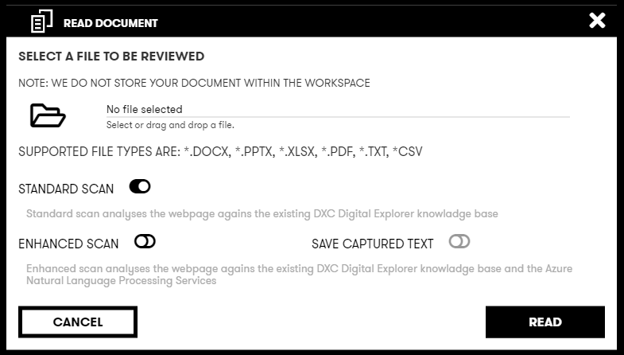
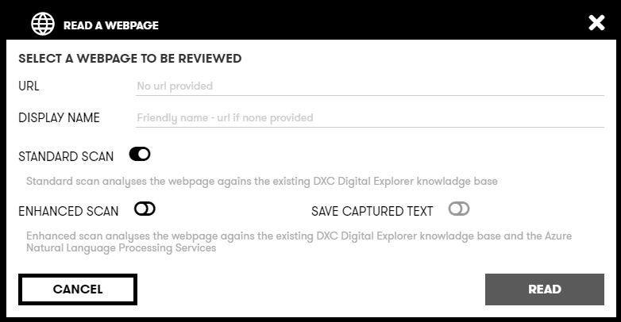
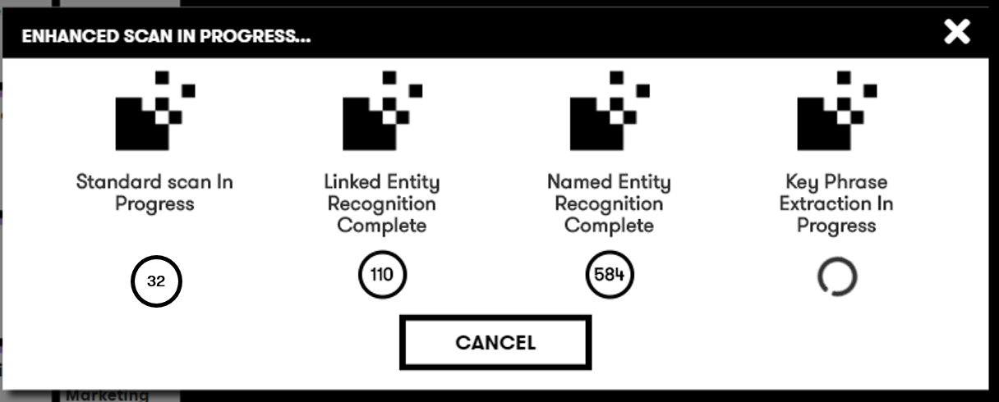
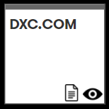
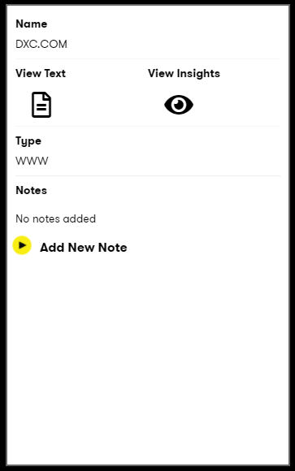
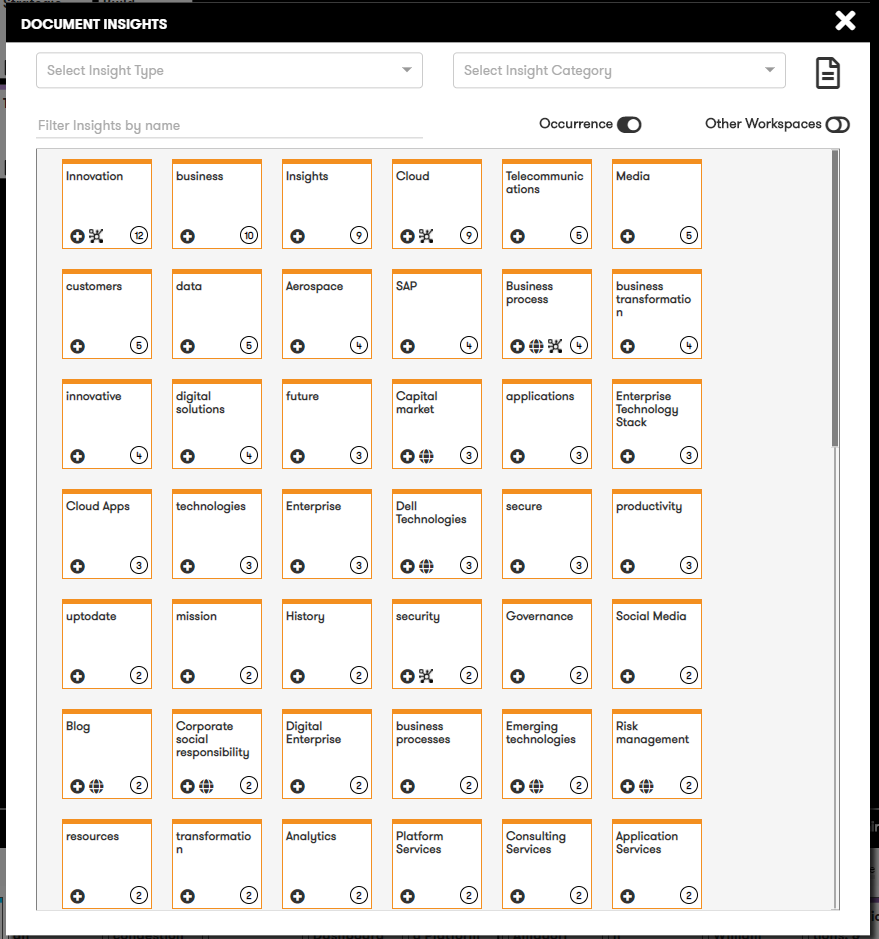
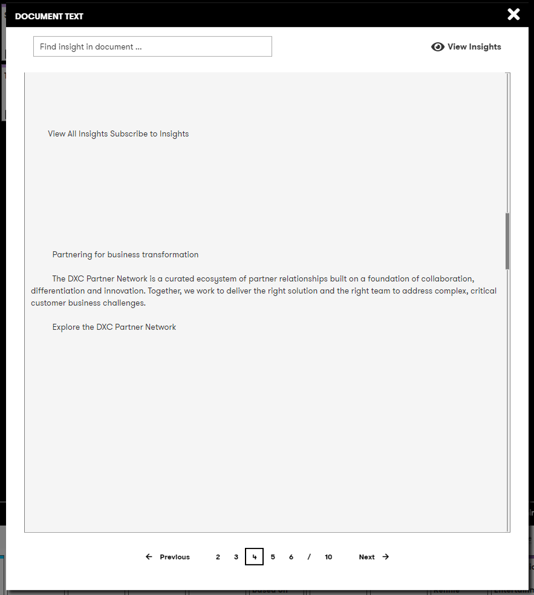
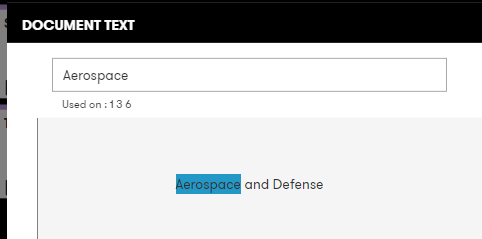

# DXC Digital Explorer - Workspace advanced document reader

_Released Nov 2020_
 

DXC Digital Explorer workspaces allows you the option to analyse documents or website and load the matching content into your workspace.

The advanced document reader leverages the [Azure Cognitive NLP](https://azure.microsoft.com/en-gb/services/cognitive-services/text-analytics/) services to provide a deep scan of the associated document.

The NLP updated scans the document against 3 core services 

- Named entities
- Linked entities
- Key phrases

Named and linked entities are matches against a managed dictionary within the Azure service, while key phrases are calculated by the NLP engine itself (and can create some interesting results).

> **How it works and some considerations**
> 
>The Azure service supports up to 5,000 characters per API call, as we read in the source document into the Workspace module we capture the document as a single text stream and then split this into a set of 5,000 character pages.   Each page is sent to the API in turn and the results are then assembled before storing within the database.   When you view the saved text the pages reflect these API generated pages and not the actual pages within the document itself.
>
>Be aware that the longer the document the more API calls you will be making.   A small document may complete its full scan in under 30 seconds, but a full annual report may take longer; the revised document reader dialog presents the progress of each stage of the enhanced document reader, so you should be able to track where you are and potentially how long the full scan should take.
>
>We have also included a check to not rescan the same document over and over again, so if you or another user has analysed the latest “DXC annual report”, the next person to do so will simply be presented with the stored results (we are planning an overwrite option for a future release).

## Access controls
Access to the enhanced document reader is currently restricted to users with "Trend Reviewer" role.

## Read Documents

 

The enhanced document reader presents 2 options

 

- Standard Scan
- Enhanced Scan

If the enhanced scan is selected, a further option to "save captured text" is available.

### Supported file types

- .DOCX
- .PPTX
- .XLSX
- .PDF
- .CSV
- .TXT

## Read Websites

The enhanced web page reader presents 2 options

 

- Standard Scan
- Enhanced Scan

If the enhanced scan is selected, a further option to "save captured text" is available.

## Scanning documents

### Scan progress

A dialog is presented to track the progress and results obtained through each stage of the analysis.

 

### Existing matches
If another users has read the enhanced scan against the same document or web page, the NLP scan will not run again.   Instead the 

 

## Insight results

### Attachment card
Potentially 2 new icons will be shown on the attachment card within the workspace canvas.

 

- the text icon is shown if the text from the document or web page has been saved
- the eye icon is shown if the enhanced scan was selected and new "insights" are available

### Viewing insights
To view the insights

- Select the associated attachment card within the canvas
- the text and insight icons are shown within the right hand information panel 
 
- select the "Insights" icon
- The insights canvas is now shown 
 

### The Insights Canvas

 

Within the insights canvas you have the following options:

- Filter based on the type of insight (linked entity, key phrase, named entity)
- Insight Category
- Show saved text
- filter based on free text entry
- sort by occurrence
- sort by insights included within other users workspaces

#### Sort by insights included within other users workspaces

Insight cards which have been added by other users to their main workspace canvas include a "graph" icon within the card.

 
 

#### Adding insights to your main workspace canvas

 

Select the (+) icon within the insight card to add the insight card to your main workspace canvas

## Text viewer

If the option to save the text during the initial scan was selected the raw text is available to be viewed.  Within this view you can select any of the matched insights 

 

Within the text view you have the following options: 

- highlight insights by name (list or free text search)
- View insight canvas

### searching and text highlights

 

The selected text is highlighted within the document text and you can also click to jump to any other page where the text is included.

 

:bulb: The text pages are defined by 5000 characters sections from the original document and do not represent the actual pages within the original document

